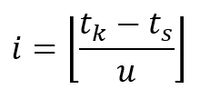
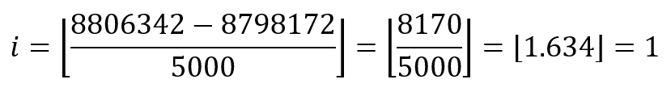
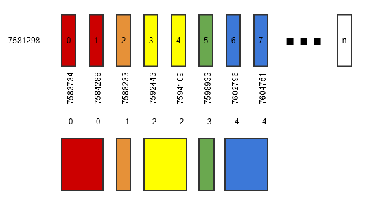
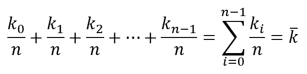

# Metric Aggregation

The MetricsProvider class provides metric data for various data points.

The data provided is streamed in two modes:
* Real Time
  * A slice of the data that has been collected over time.
* Aggregate
  * Data that has been rolled-up to various time increments.

## Time Indexes

The strategy for aggregation centers around time indexes.  Imagine an array
of values and each element of that array being a data point.  If the data
is real-time, then each index is just one logical second.  When the data
is aggregated, each data point is the average of the data, for one logical
grouping of time.

To determine which data elements from the real-time array are to be grouped,
the difference in time from the start of the process and the moment a data
point was captured is passed through this formula:

</img>

Where

* `i`
  * Time Index
* `t[k]`
  * Time of element `k`
* `t[s]`
  * Start time of process
* `u`
  * Time unit of measure (e.g. 5000ms=5s)

All Times are expressed in milliseconds (ms) and are obtained from Date.now().

**Example**

</img>

The above example demonstrates that for a 5000ms (5s) aggregate, the time index
for the data point is one.  This formula is applied to all data points, so
when many data points share the same logical time index, they can be averaged.
When two or more array elements have a common time index, they form a time band.

</img>

In the above visual, the start time `t[s]` is `7581298`.  The unit of time is `5000ms`.  By applying
the time index equation against each data points' moment in time, the time index values are
derived.  For those that match, a time band is formed.  These are colorized similarly.

## Averaging

To efficiently perform the average, care is taken to reduce the number of
CPU cycles required to analyze the data.  To accomplish this, the program
calculates the average inline with the originating transaction.

Also, to prevent re-aggregating the data needlessly, each aggregate level
maintains its position in the base array, thereby keeping track of where it
left off.  This is done using two simple numbers: the last array element
examined and the start of the current time band.

So that data is still streamed on an event-basis, an aggregate data point is
only captured and emitted when it is complete.  To detect when an aggregate
is complete, the algorithm traverses the base real-time array of data, beginning
where it left off for any given aggregate.  Walking each element from there
forward, a simplistic level-break algorithm is implemented.  As and when a
logical time index changes, this indicates that the previous set of data is
complete.

Once this occurs, the program then averages the data from the starting index
through the ending index that spans a logical time unit, regardless of aggregate
level (using the time index formula above).

To ensure no overflows (and therefore `NaN`) are produced, the average is done
using the formula on the left-side of this equivalence:

</img>

The sum of memory usage even over a 10s aggregate is enough to produce `NaN`.
